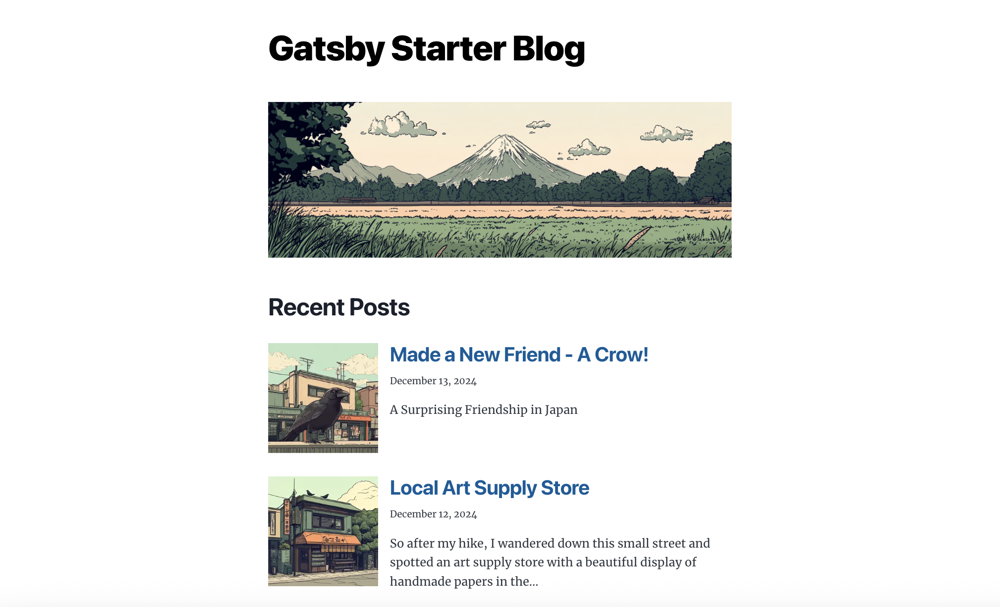

# Gatsby Starter Blog (TypeScript Edition)

A **modernized fork** of the official [Gatsby Starter Blog](https://github.com/gatsbyjs/gatsby-starter-blog), rebuilt with **TypeScript** and updated dependencies.  
This starter provides a solid, typed foundation for building fast, scalable blogs or personal websites with Gatsby.

🔗 **Repo:** [JGallardo/gatsby-starter-blog-ts](https://github.com/JGallardo/gatsby-starter-blog-ts)  
📚 **Docs:** [Gatsby Documentation](https://www.gatsbyjs.com/docs/)  
🚀 **Live preview:** https://gatbsystarterblog.netlify.app/

## 👀 Preview



---

## ✨ Features

- Fully typed with **TypeScript 5**
- Compatible with **Gatsby 5+**
- Stronger type safety for components & pages
- Same simplicity as the original starter
- Great baseline for blogs, portfolios, or documentation sites

---

## 🛠 Tech Stack

- Gatsby 5+
- TypeScript 5
- React 18
- GraphQL (built-in data layer)
- Deployment ready for Netlify, Vercel, or any static host

---

## 🚀 Quick Start

> Requires Node 20+ and npm 9+ (or Yarn).
> Built and deployed on Node 20. Should also work on Node 18+ (see `engines` in `package.json`).

1. **Clone this repo**

   ```bash
   git clone https://github.com/JGallardo/gatsby-starter-blog-ts.git my-blog
   cd my-blog
   ```

2. **Install dependencies**

   ```bash
   npm install
   # or
   yarn install
   ```

3. **Run the development server**

   ```bash
   npm run develop
   # or
   gatsby develop
   ```

   - Visit [http://localhost:8000](http://localhost:8000)

   - GraphiQL: [http://localhost:8000/\_\_\_graphql](http://localhost:8000/___graphql)

---

## ✍️ Create a post (quick)

1. Create `content/blog/my-post/index.md`
2. Add frontmatter (the `featured` image is used on the posts list page):
   ```yaml
   ---
   title: "Post Title"
   date: "2024-12-12"
   description: "Short summary for previews."
   featured: "./featured.png" # used for the post thumbnail on the list page
   featuredAlt: "Describe the featured image"
   ---
   ```
   * If the image lives in a subfolder, use: featured: `"./images/featured.png"`
   * If you move things around and Gatsby can’t find it, run `gatsby clean` and restart.
3. Add the image file to match the path you used
   – `./featured.png` → put `featured.png` next to `index.md`
   – `./images/featured.png` → put it in an `images/` subfolder
4. Run:
   ```bash
   npm run develop
   ```
   then open `http://localhost:8000/my-post/`.

## 🗂 What’s inside (and what to change)

A quick look at the top-level files and the places you’ll likely customize.

```text
.
├── content/
│   └── blog/                      # ✏️ Your posts: replace samples; each post in its own folder with index.md (+ images)
├── src/
│   ├── components/
│   │   ├── bio.tsx                # ✏️ Update name/role/links; swap avatar at src/images/profile-pic.png
│   │   ├── hero.tsx               # ✏️ Swap src/images/hero-bg.png + alt text, or remove Hero from pages/index.tsx
│   │   ├── layout.tsx             # ✏️ Header title/nav/footer; add links (About/Contact), tweak wrappers/classes
│   │   └── seo.tsx                # ✏️ Uses siteMetadata; per-page <Seo .../>; ensure twitter:* (not x:*) tags
│   ├── images/
│   │   ├── profile-pic.png        # ✏️ Replace with your avatar
│   │   └── hero-bg.png            # ✏️ Replace or delete if no hero
│   ├── pages/
│   │   ├── index.tsx              # ✏️ Posts list; shows thumbnails using frontmatter.featured
│   │   └── 404.tsx                # ✏️ Customize not-found message/links
│   └── templates/
│       └── blog-post.tsx          # ✏️ Single post layout; edit header/footer/nav; add frontmatter fields (e.g., image) and pass to <Seo />
├── static/                        # (Optional) Favicons, robots.txt, CNAME
├── gatsby-browser.js              # Browser hooks (e.g., global CSS)
├── gatsby-config.js               # ✏️ Set siteMetadata { title, description, siteUrl, social:{ x } }; verify filesystem plugin paths
├── gatsby-node.js                 # Creates pages from content/blog/**; tweak slug/date logic if needed
├── gatsby-ssr.js                  # SSR hooks (wrap root, inject head tags if desired)
├── tsconfig.json                  # TS config
├── .eslintrc / .prettierrc        # Lint/format rules
├── package.json                   # Scripts (dev/build/serve) and deps
├── LICENSE
└── README.md
```

## 🧩 Components (what they do & what to edit)

These files live in `src/components/`. They’re small, focused pieces used by pages and templates.

### `bio.tsx`

**What it does:** Renders your author avatar + short bio under posts or on the homepage.  
**Why edit:** Make it yours—name, role, links, and image.

- Replace `src/images/profile-pic.png` with your photo (same filename or update the import).
- Update any hard-coded text (name/role) and links in the component.
- Optional: If you want to source name/links from `siteMetadata`, add fields to `gatsby-config.js` and query them here.
- Accessibility: set a meaningful `alt` for your avatar.

### `hero.tsx`

**What it does:** Displays a full-width hero image using `gatsby-plugin-image`’s `StaticImage`.  
**Why edit:** Controls the first visual your visitors see.

- Swap `src/images/hero-bg.png` for your own asset and adjust `alt` text.
- You can remove the component from `src/pages/index.tsx` if you don’t need a hero.
- Keep `quality` and `formats` unless you know you need different trade-offs.

### `layout.tsx`

**What it does:** Global wrapper: header, main, footer. Handles the “big title” on the home route.  
**Why edit:** It defines your site chrome and navigation.

- Change the header title or add a nav bar (e.g., About, Blog, Contact).
- Update the footer text/links.
- Adjust the “root path” logic if you customize routes.
- Add wrappers/classes for your design system (e.g., container widths, theme toggles).

### `seo.tsx`

**What:** Sets `<title>` and basic SEO/social meta from `siteMetadata`.  
**Why:** Better search results and link previews.

- In `gatsby-config.js`, set `siteMetadata.title`, `description`, `siteUrl`, and `social: { x: "@yourhandle" }`.
- Per page: `<Seo title="About" description="..." image="/images/og-about.jpg" />`
- Use `twitter:*` tags (not `x:*`) for Twitter cards.

### `src/templates/blog-post.tsx`

**What:** Single post template. Renders a markdown post, injects SEO, and shows prev/next links.  
**Why edit:** Control post layout, metadata, and what frontmatter you expect.

- **Data pulled:** `markdownRemark { html, excerpt(160), frontmatter { title, date, description } }`  
  Plus `site.siteMetadata.title` for header, and `previous/next` for nav.
- **SEO:** `<Head>` uses `<Seo title={frontmatter.title} description={frontmatter.description || excerpt} />`.
- **Markup:** Header shows `title` + formatted `date`; footer shows `<Bio />`.

**Edit these if needed**

- Change date format in the query: `date(formatString: "MMMM DD, YYYY")`.
- Tweak `<header>`, `<footer>`, and the nav to add tags, categories, or share links.
- Add a hero/OG image: put `image` in frontmatter, extend the query, and pass to `<Seo image={...} />`.

### 🔑 Don’t forget

- Update **gatsby-config.js → siteMetadata** before deploying.
- Replace sample content in **content/blog/**, **profile-pic.png**, and **hero-bg.png**.

## 📦 Deploy (Netlify via GitHub)

**Option A — One-click (recommended):**

[](https://app.netlify.com/start/deploy?repository=https://github.com/JGallardo/gatsby-starter-blog-ts)

Netlify will:

1. Ask you to **log in with GitHub** and authorize access.
2. Let you **pick the repo** (your fork of this starter).
3. Pre-fill build settings → click **Deploy**.

**Option B — Manual import:**

1. Push your code to **GitHub** (public or private).
2. Go to **Netlify → Add new site → Import an existing project**.
3. **Connect GitHub** (authorize if prompted) and **select your repo**.
4. Set **Build command:** `npm run build` _(or `gatsby build`)_  
   Set **Publish directory:** `public`
5. Click **Deploy site**.
6. After the first build, you’ll get a Netlify URL. Add a custom domain in  
   **Site settings → Domain management**.
7. **Continuous deploy** is on: every push to `main` triggers a rebuild.
