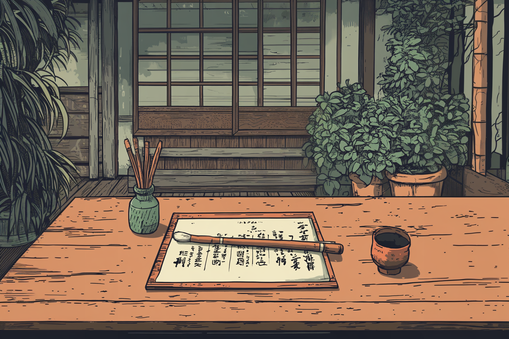

So after my hike, I wandered down this small street and spotted an art supply store with a beautiful display of handmade papers in the window. Once inside, I noticed how meticulously organized everything was - really spoke to my appreciation for ordered spaces. Found these calligraphy brushes made from this specific type of weasel hair that apparently comes from just one region in northern Japan.

The brush handles were crafted from bamboo that had these subtle variations in color - pretty fascinating from a materials science perspective. Got three different sizes, each with slightly different hair densities.

They're actually quite different from the mass-produced brushes you typically find. Going to spend hours practicing with them.
