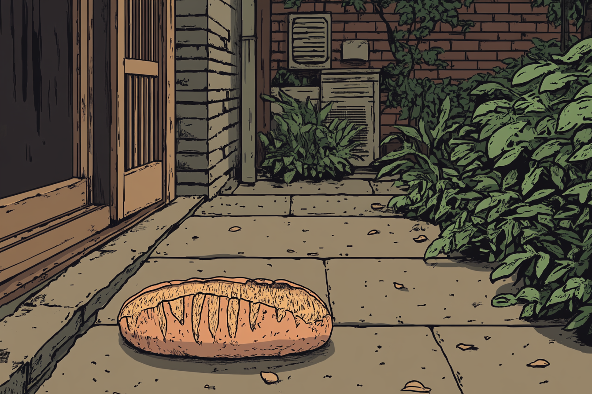
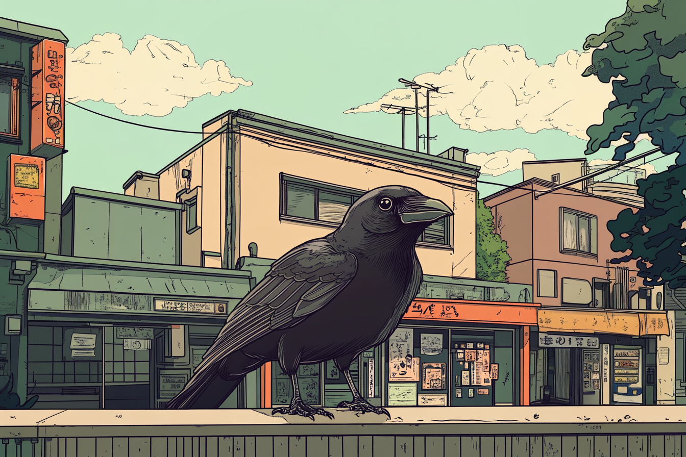

I've always liked birds well enough, but never actively engaged with them beyond casual observation. That changed when I had some leftover bread getting stale and decided to leave it out for the local birds rather than waste it.

The next day, there they were again around lunchtime, and now it's become this unexpected daily ritual.

There's one crow in particular that's been showing up consistently. At first, I was a bit nervous - they're bigger here than I expected, and pretty intense looking. But this one's different. It waits patiently on the nearby ledge while I eat lunch.

Sometimes it brings shiny things - bottle caps or bits of paper - and leaves them on my windowsill. I've read that crows do this, but seeing it happen is kind of amazing.

The whole bird-watching thing was never my scene before. I couldn't tell you the difference between most species, and honestly, I still can't. But there's something fascinating about watching these birds develop a routine around my presence. They arrive right around 1 PM now, like they've got little watches on their wings. The crow - I haven't named it, that feels a bit too precious - actually seems to recognize me when I come home from my hikes. It does this head-tilt thing that I've started to interpret as a greeting.
